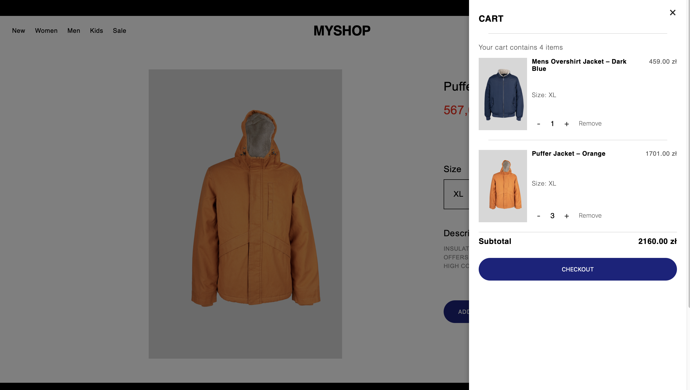

# MyShop

MyShop is an e-commerce store, with a responsive layout, built with **Shopify** and custom Liquid, CSS, and JavaScript components.

It allows users to browse collections, search for products, choose sizes, and manage items in a shopping cart for checkout.

The store’s design and experience are inspired by the style and aesthetic of the **Pangaia** online shop, focusing on simplicity, usability, and a fashion-forward look.

## Features

- Browse product collections and categories
- Search for products by name or attributes
- Select product variants such as size or color
- Add, update, and remove items in the shopping cart
- View product details including images, prices, and descriptions

## Technologies Used

- **Responsive layout for desktop and mobile**
- **Shopify Liquid**
- **HTML, CSS, JavaScript**
- **AJAX for cart updates**
- **JSON API for product data**

## Skills Demonstrated

- Building a responsive, interactive e-commerce interface
- Working with Shopify theme development and Liquid templating
- Implementing dynamic cart functionality with JavaScript and AJAX
- Managing product variants and forms

## UX Principles Applied

The design of MyShop incorporates few key UX principles to create an intuitive and user-friendly experience:

- **Aesthetic-Usability Effect**  
Clean and visually appealing design with large product imagery makes the shop feel modern and easy to use, increasing perceived usability.

- **Chunking**  
Products are displayed in consistent cards with grouped details (image, title, price), enabling users to easily scan content.

- **Jakob’s Law**  
Navigation and product pages follow familiar e-commerce patterns (menu at the top, product grid, filters, add-to-bag button), reducing the learning curve for users.

- **Von Restorff Effect**  
Discounted prices are highlighted in red, standing out from other text and drawing attention to promotions.

## Run

Go to https://mystorewk.myshopify.com and enter the password: **demo**

## Preview

